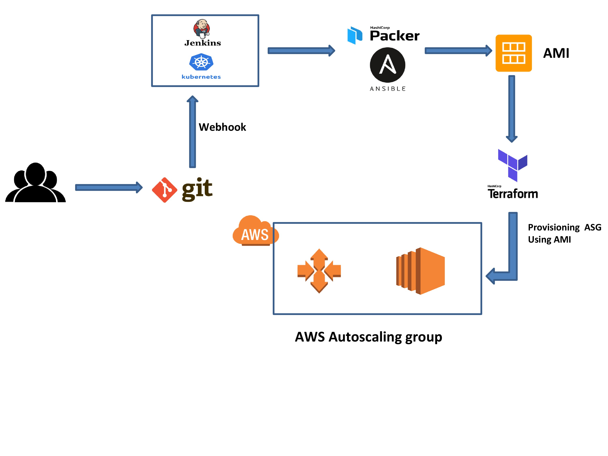

## FLASK API

# AWS Deployment System Diagram

## Structure
* [Dockerfile](./Dockerfile) : multistage Dockerfile for build tool image which will be used in jenkins k8s for running jenkins stages.
* [flask api code](./api-code/) : configs for python flask api.
* [Terraform](./terraform/) : terraform modules and tf configs to deploy application on AWS without Downtime.
* [Packer](./packer) : Packer configuration for setting up pre-baked AMI for AWS.
* [Ansible Roles](./Packer/roles) : Ansible roles and config files to setup mysql DB and python flask app in AMI.
* [Jenkinsfile](./Jenkinsfile) : Jenkinsfile for running Jenkins stages on k8s cluster.
